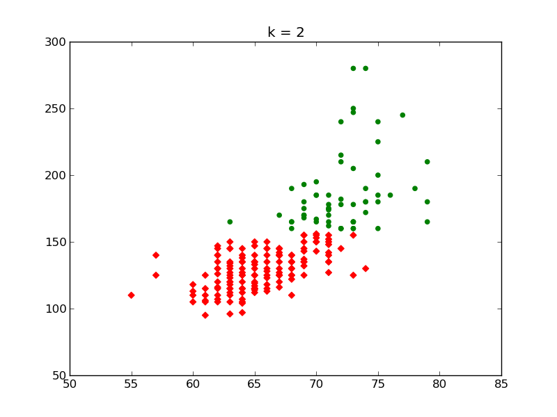
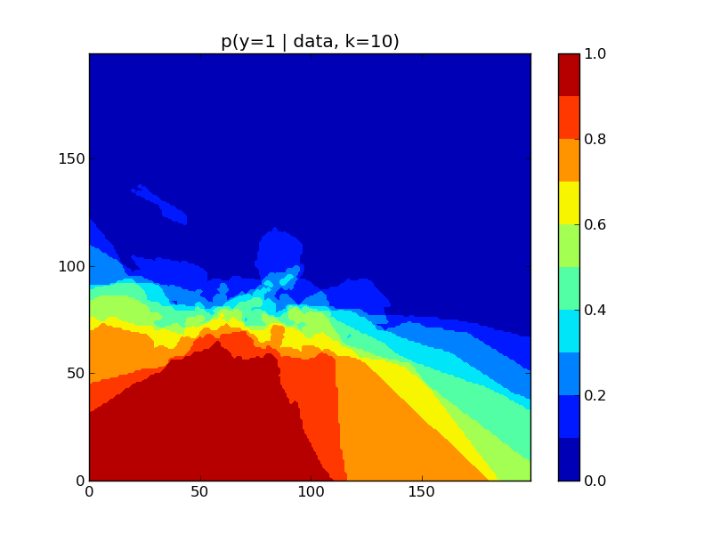
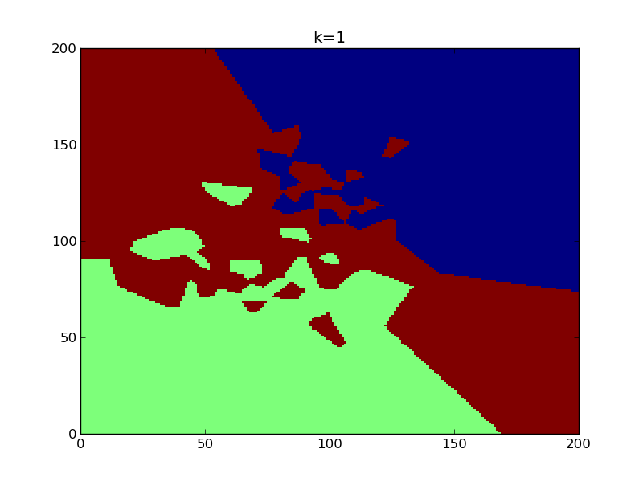
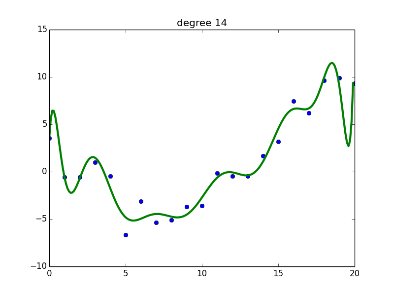
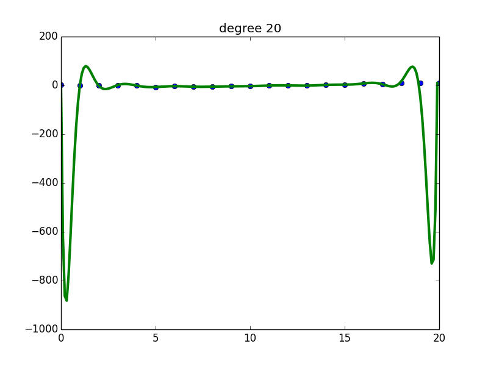

ch01
========================================

kmeansHeightWeight
----------------------------------------
.. image:: kmeansHeightWeight_1.png

.. image:: kmeansHeightWeight_3.png
.. literalinclude:: kmeansHeightWeight.py

shuffledDigitsDemo
----------------------------------------
.. image:: shuffledDigitsDemo_unshuffled.png
.. image:: shuffledDigitsDemo_shuffled.png
.. literalinclude:: shuffledDigitsDemo.py

knnClassifyDemo
----------------------------------------
.. image:: knnClassifyDemo_hotmap_0.png
.. image:: knnClassifyDemo_k10.png
.. image:: knnClassifyDemo_4.png

.. image:: knnClassifyDemo_hotmap_2.png
.. image:: knnClassifyDemo_1.png
.. image:: knnClassifyDemo_k5.png
.. image:: knnClassifyDemo_2.png

.. literalinclude:: knnClassifyDemo.py

fisheririsDemo
----------------------------------------
.. image:: fisheririsDemo.png
.. literalinclude:: fisheririsDemo.py

gaussPlotDemo
----------------------------------------
.. image:: gaussPlotDemo.png
.. literalinclude:: gaussPlotDemo.py

newsgroupsVisualize
----------------------------------------
.. image:: newsgroupsVisualize.png
.. literalinclude:: newsgroupsVisualize.py

curseDimensionality
----------------------------------------
.. image:: curseDimensionality.png
.. literalinclude:: curseDimensionality.py

knnVoronoi
----------------------------------------
.. image:: knnVoronoi_1.png
.. image:: knnVoronoi_2.png
.. literalinclude:: knnVoronoi.py

sigmoidPlot
----------------------------------------
.. image:: sigmoidPlot.png
.. literalinclude:: sigmoidPlot.py

linregPolyVsDegree
----------------------------------------
.. image:: linregPolyVsDegreeUcurve.png
.. image:: polyfitDemo1.png
.. image:: polyfitDemo2.png
.. image:: polyfitDemo10.png

.. literalinclude:: linregPolyVsDegree.py
